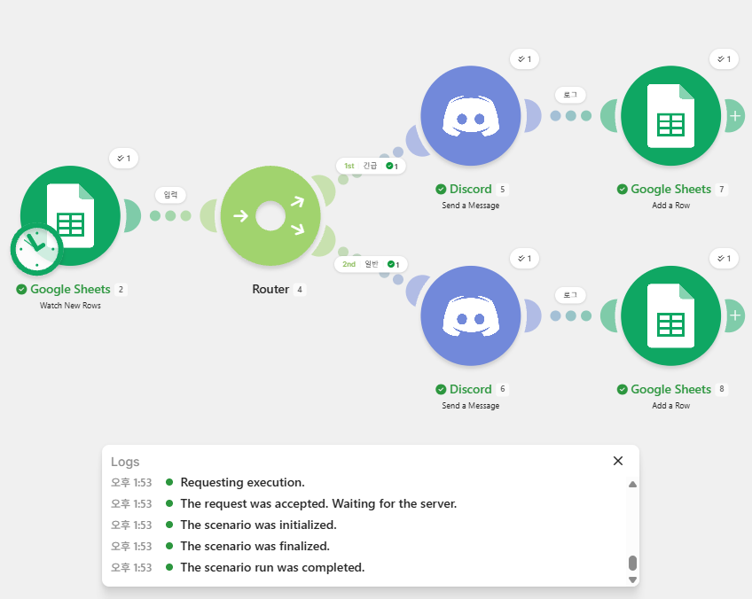
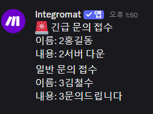
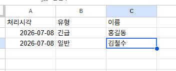
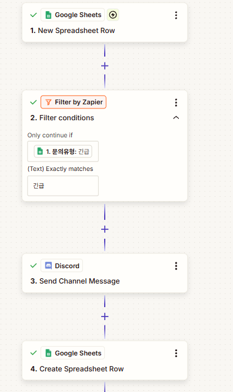
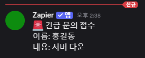
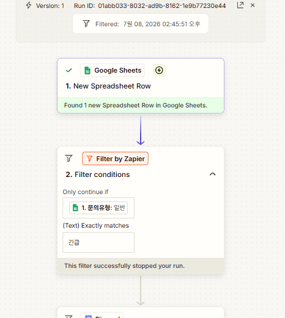
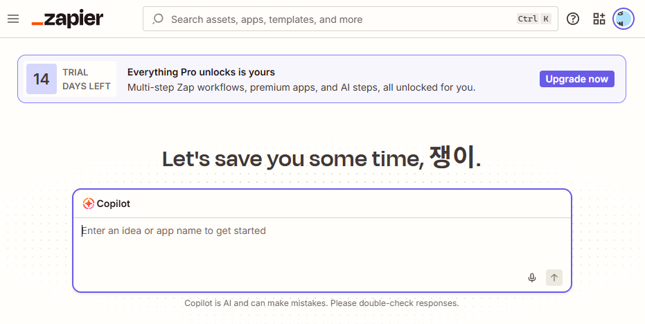

# 노코드 자동화 워크플로우 구축 (Make · Zapier)

Make · Zapier 등 노코드 자동화 도구로 Trigger–Action–조건 분기 기반의 워크플로우를 직접 설계·구현한 과제입니다. 이 문서 하나에 프로젝트 1·2의 모든 내용(설계 기준, 워크플로우 구조, 비교 분석, 심화 고찰)이 담겨 있습니다.

## 목표

- Trigger(시작 이벤트)와 Action(처리 동작)의 작동 원리 이해
- 조건 분기(Filter/Router)의 역할 이해
- 서로 다른 자동화 도구의 특징을 업무 관점에서 비교
- 업무에 적합한 도구를 선정하고 근거 설명

## 구성

| 프로젝트 | 내용 | 사용 도구 |
|----------|------|-----------|
| 프로젝트 1 | 동일 워크플로우를 2개 도구로 구현·비교 | Make, Zapier |
| 프로젝트 2 | 자유 주제 자동화 설계·구현 (날씨 알림) | Make |

## 공통 요구사항

- Trigger 1개 이상 / Action 2개 이상 / 조건 분기(Filter/Router) 1개 이상
- 각 분기 경로가 실제로 1회 이상 실행된 결과 확인

## 보안 유의사항

모든 스크린샷과 문서에서 API Key, 토큰, Webhook URL, 비밀번호, 계정 이메일 등 민감정보는 마스킹(`***`) 처리했습니다.

---

# 핵심 개념: Trigger와 Action의 차이

| 구분 | Trigger (시작 이벤트) | Action (처리 동작) |
|------|----------------------|--------------------|
| 역할 | 워크플로우를 **시작시키는** 이벤트. "언제 실행할지"를 결정 | Trigger 이후 **수행하는** 작업. "무엇을 할지"를 결정 |
| 개수 | 워크플로우당 보통 1개(시작점) | 여러 개 연결 가능 |
| 실행 방향 | 외부 → 워크플로우 (감지/수신) | 워크플로우 → 외부 (동작/출력) |
| 프로젝트1 예시 | Google Sheets에 **새 행이 추가됨**(문의 접수) | ① Discord로 **알림 전송** ② 시트에 **처리 로그 기록** |
| 프로젝트2 예시 | **매일 오전 7시**가 됨(스케줄) | ① 날씨 조회 ② Discord 알림 ③ Data store 기록 |

**한 문장 요약**: Trigger는 "무엇이 워크플로우를 깨우는가", Action은 "깨어난 뒤 무엇을 하는가"이다. 예컨대 "새 문의가 접수되면(Trigger) → 담당자에게 알림을 보낸다(Action)"에서 앞 절이 Trigger, 뒷 절이 Action이다. Trigger 없이 Action만으로는 스스로 실행되지 않고, Action 없이 Trigger만으로는 아무 결과도 만들지 않는다.

---

# 프로젝트 1 · 자동화 도구 비교 구현 (Make vs Zapier)

## 1.1 개요

동일한 자동화 워크플로우를 **Make**와 **Zapier** 두 도구로 각각 구현하고 비교 분석한다. 노코드 자동화의 핵심 개념인 Trigger, Action, 조건 분기(Filter/Router)의 작동 방식을 두 도구에서 어떻게 다르게 구현하는지 직접 확인하는 것이 목표다.

## 1.2 구현한 워크플로우

**시나리오: 고객 문의 자동 분류 및 알림**

Google Sheets에 문의가 접수되면(1행 = 1건), 문의 유형(`긴급` / `일반`)에 따라 분기하여 Discord로 알림을 보내고 처리 이력을 별도 시트에 기록한다.

```
[Trigger]  Google Sheets - 새 행 추가 감지
      │
   [조건 분기]  문의유형 판별 (긴급 / 일반)
      │
      ├─ 긴급 → [Action 1] Discord 알림  → [Action 2] 로그 시트 기록
      └─ 일반 → [Action 1] Discord 알림  → [Action 2] 로그 시트 기록
```

### 데이터 구조

| 시트 | 컬럼 |
|------|------|
| 입력 시트(시트1) | timestamp / name / email / 문의유형 / 내용 |
| 로그 시트 | 처리시각 / 유형 / 이름 |

- Trigger 1개, Action 2개(Discord 알림 + 시트 기록), 조건 분기 1개 → 요구사항 충족
- 테스트 데이터: `긴급 / 홍길동 / 서버 다운`, `일반 / 김철수 / 문의드립니다`

### 두 도구의 동일성을 맞추기 위해 적용한 설계 기준

두 도구를 "공정하게" 비교하려면, 도구를 제외한 나머지 조건을 최대한 동일하게 통제해야 한다. 다음 기준을 고정했다.

| 통제 항목 | 고정한 기준 | 이유 |
|-----------|-------------|------|
| 입력 데이터 소스 | 동일한 Google Sheets(같은 컬럼: timestamp/name/email/문의유형/내용) | Trigger 입력을 동일하게 하여 분기 결과가 도구 차이 때문임을 보장 |
| Trigger 유형 | 양쪽 모두 "새 행 추가 감지"(Sheets Row) | 시작 이벤트를 동일하게 맞춤 |
| 분기 기준 값 | 양쪽 모두 `문의유형` 컬럼, 값은 `긴급`/`일반`으로 통일 | 분기 판정 로직을 동일하게 유지 |
| Action 종류·순서 | ① Discord 알림 → ② 로그 기록 순으로 동일 | Action 개수와 순서를 맞춰 결과물의 형태를 일치 |
| 알림 채널 | 동일한 Discord 채널 사용 | 출력 대상 통일 |
| 테스트 데이터 | 동일한 2건(긴급-홍길동, 일반-김철수) 사용 | 실행 결과를 1:1로 대조 가능 |

**의도적으로 다르게 둔 단 하나의 변수**는 "조건 분기 구현 방식"이다. Make는 Router(양방향), Zapier는 Filter(단방향)로 구현했는데, 이는 각 도구가 **무료 플랜에서 제공하는 분기 방식이 다르기 때문**이다(Make는 Router 무료, Zapier는 Paths가 유료). 즉 나머지 조건은 모두 통제하고 "도구 고유의 분기 방식 차이"만 변수로 남겨, 그 차이가 비교 분석의 핵심 관찰 대상이 되도록 설계했다.

## 1.3 도구별 구현 과정 요약

### Make (Router 방식 · 양방향 분기)

1. **Google Sheets → Watch New Rows** 모듈로 새 행 감지 (Trigger)
2. **Router** 모듈로 분기 생성
3. 경로 1 Filter: `문의유형 = 긴급` → Discord 알림 → Google Sheets(Add a Row) 로그 기록
4. 경로 2 Filter: `문의유형 = 일반` → Discord 알림 → Google Sheets(Add a Row) 로그 기록
5. **Run once**로 실행 → 긴급/일반 두 경로가 각각 1회씩 실행되어 Discord 메시지 2건, 로그 2행 생성 확인

> Make는 Router가 **여러 갈래를 동시에** 두고 각 갈래에 필터를 걸 수 있어, "긴급은 A, 일반은 B"처럼 **양방향(다방향) 분기**를 하나의 시나리오로 처리할 수 있다.

### Zapier (Filter 방식 · 단방향 통과)

1. **Google Sheets → New Spreadsheet Row** 로 새 행 감지 (Trigger)
2. **Filter by Zapier**: `문의유형 Exactly matches 긴급` → 긴급일 때만 이후 단계 진행
3. **Discord → Send Channel Message** 알림 (Action 1)
4. **Google Sheets → Create Spreadsheet Row** 로그 기록 (Action 2)
5. 실행 결과
   - 긴급(홍길동) 행 → Filter 통과 → Discord 알림 도착 + 로그 기록
   - 일반(김철수) 행 → Filter에서 중단(`This filter successfully stopped your run`)

> Zapier의 Filter는 **조건을 만족할 때만 통과시키는 단방향 게이트**다. "긴급만 통과, 일반은 중단" 구조이므로, 일반 건은 별도 Action 없이 흐름이 멈춘다. 양방향 분기를 하려면 Paths 기능이 필요하다.

## 1.4 비교 분석

| # | 비교 항목 | Make | Zapier |
|---|-----------|------|--------|
| 1 | **UI/UX** | 노드(모듈)를 캔버스에 자유 배치하는 시각적 방식. 분기가 갈래로 눈에 보여 흐름 파악이 직관적 | 위→아래 단계 리스트 방식. 순차 흐름은 깔끔하나 분기 구조는 시각적으로 덜 드러남 |
| 2 | **설정 난이도** | 초기 학습 곡선 존재(모듈/Router 개념, 필드 매핑 방식). 익숙해지면 유연 | 단계별 안내가 친절해 진입장벽 낮음. Filter/Path 개념만 이해하면 빠름 |
| 3 | **조건 분기 구현 방식** | **Router + Filter**로 양방향 분기 (긴급/일반 모두 각각 Action 실행) | **Filter**는 단방향 통과. 양방향은 **Paths**(상위 요금제 기능) 필요 |
| 4 | **연동 서비스 범위** | 광범위(1,000+ 앱). HTTP/Webhook 등 커스텀 연동이 유연 | 광범위(6,000+ 앱). 대중적 SaaS 커넥터가 특히 풍부 |
| 5 | **무료 플랜 범위** | 월 1,000 operations, Router 등 핵심 기능 무료 사용 가능 | 무료는 2단계(Trigger+Action 1)·월 100 tasks 제한. Filter/Multi-step/Paths는 유료 |
| 6 | **실행 로그 확인** | 시나리오 위 실행 배지(✓)와 History에서 **모듈별 입출력 데이터**를 단계별로 확인 | Zap History에서 실행별 상태 확인. Filter 중단 시 `Filtered / stopped your run` 명확히 표시 |
| 7 | **에러/재실행** | History에서 개별 실행 재시도 가능, 모듈 단위 디버깅 용이 | Zap History에서 실패 건 재실행(Replay) 지원 |

## 1.5 각 도구의 장단점

**Make 장점**: Router로 양방향/다방향 분기를 하나의 시나리오에서 자연스럽게 구현 · 시각적 캔버스로 복잡한 흐름도 한눈에 파악 · 무료 플랜에서 Router·다중 Action 등 핵심 기능 사용 가능(과금 리스크 낮음) · 모듈별 실행 데이터가 상세해 디버깅이 편리
**Make 단점**: 개념(모듈, Router, 매핑)에 익숙해지기까지 학습 시간 필요 · 필드 매핑 시 인접 값이 딸려 들어가는 등 초반 실수가 나기 쉬움

**Zapier 장점**: 단계별 위저드형 UI로 초보자도 빠르게 첫 Zap 완성 · 방대한 앱 커넥터, 대중적 서비스 연동이 강점 · Filter 중단 결과가 로그에 명확히 표기되어 원인 파악이 쉬움
**Zapier 단점**: 무료 플랜 제약이 큼(2단계 제한, Filter·Multi-step·Paths는 유료) · 본 과제의 Action 2개 + 조건 분기 구조는 무료 플랜만으로 구현 불가 · 리스트형 UI라 분기 구조가 시각적으로 잘 드러나지 않음

## 1.6 상황별 적합성 (업무 요구사항 관점)

도구의 기능 차이는 "어떤 업무 요구사항이냐"에 따라 장단점이 뒤바뀐다. 아래는 업무 요구사항을 기준으로 두 도구를 연결한 것이다.

| 업무 요구사항 | 더 적합한 도구 | 근거 (기능 차이 → 업무 영향) |
|---------------|----------------|------------------------------|
| 조건에 따라 여러 갈래로 다르게 처리 (예: 긴급→즉시 알림, 일반→회신, VIP→전담 배정) | **Make** | Router 양방향 분기가 무료 지원 → 갈래별 다른 처리를 한 시나리오에서 구현, 유지보수 단순 |
| 예산이 없고 무료로 운영 | **Make** | 무료 1,000 ops + Router/다중 Action 지원 → 추가 비용 없이 분기·다단계 완주 |
| 비개발 직군이 빠르게 단순 연동 (예: 폼 제출 → 슬랙 알림) | **Zapier** | 위저드형 UI·방대한 커넥터 → 학습 없이 수 분 내 직선형 Zap 완성 |
| 마이너/특수 SaaS까지 폭넓게 연동 | **Zapier** | 6,000+ 커넥터로 커버리지가 넓어 연동 대상 탐색 비용 감소 |
| 실행 데이터를 단계별로 뜯어보며 디버깅 | **Make** | History에서 모듈별 입출력 데이터 확인 → 오류 지점 특정이 빠름 |
| 대량 실행이 잦아 실행 건수 관리가 중요 | **상황에 따라** | Make는 ops 단위, Zapier는 task 단위 과금 → 워크플로우 구조에 따라 유리한 쪽이 달라짐 |

**요약**: 본 과제처럼 "조건 분기 + 다단계 Action + 무료 운영"이 요구사항이면 **Make가 명확히 유리**하다. 반대로 "분기 없는 단순 1:1 연동을 비개발자가 신속히"가 요구사항이면 **Zapier**가 낫다. 도구 우열은 절대적이지 않고 업무 요구사항에 종속된다.

## 1.7 제약 사항 및 무료 대안

**Zapier 유료(트라이얼) 기능 사용 사유**: 본 구현에서 Zapier는 Filter + Multi-step(Action 2개)을 사용했는데, 이는 무료 플랜에서 제공되지 않는 기능이다. 가입 시 자동 제공된 **14일 Pro 트라이얼** 기간 내에 구현·테스트를 완료했다(첨부: `14 TRIAL DAYS LEFT` 배지 캡처). 트라이얼 만료 후에는 해당 Zap이 무료 플랜 제한(2단계)에 걸려 정상 동작하지 않는다.

**무료 대안**: 동일 구조를 완전 무료로 구현하려면 **Make**가 대안이다. Make 무료 플랜(월 1,000 ops)에서 Router·다중 Action이 모두 지원되어 본 과제 요구사항을 추가 비용 없이 충족한다.

**조건 분기 방식 차이에 따른 구현 보완**: Make는 Router로 긴급·일반 양쪽 경로 모두 Action을 실행해 두 경로의 결과를 직접 확인했다. Zapier는 Filter 단방향이라 긴급은 통과(Discord+로그), 일반은 중단된다. "각 경로 1회 이상 실행 확인" 요구는 긴급 경로(Discord 도착+로그 기록 성공)와 일반 경로(Zap History의 `This filter successfully stopped your run` 기록)로 각각 충족했다.

## 1.8 구현 결과 (캡처)

**Make — 워크플로우 구성 + 실행 로그**



**Make — Discord 알림 결과 (긴급/일반)**



**Make — 로그 시트 기록**



**Zapier — 4단계 Zap 구성**



**Zapier — Discord 긴급 알림 (Filter 통과)**



**Zapier — Filter 중단 로그 (일반 경로)**



**Zapier — 트라이얼 배지 (유료 기능 사용 근거)**



---

# 프로젝트 2 · 자유 주제 자동화 (날씨 기반 아침 알림)

매일 아침 자동으로 날씨를 조회해, 비 예보 여부에 따라 Discord로 알림을 보내고 조회 이력을 Make Data store에 기록하는 워크플로우입니다.

## 2.1 자동화할 반복 업무 정의

**업무**: 매일 아침 오늘 날씨(특히 비 여부)를 확인하고, 비가 오면 우산을 챙기라고 스스로 리마인드하는 일.

**반복성/자동화 필요성**: 매일 아침 수동으로 날씨 앱을 열어 확인하는 것은 반복적이고 잊기 쉽다. "비 예보 시 우산 챙기기"라는 판단(조건 분기)이 개입되므로, 조회 → 판정 → 알림을 자동화하면 매일 일정한 시각에 빠짐없이 처리할 수 있다.

## 2.2 선정 도구 및 선정 이유

**선정 도구: Make**

| 선정 이유 | 설명 |
|-----------|------|
| 스케줄 자동 실행 내장 | 별도 스케줄러 앱 없이 시나리오 자체에 "매일 07:00 실행" 스케줄을 설정할 수 있어 "Trigger 발생 시 자동 실행" 제약을 쉽게 충족 |
| Router로 조건 분기 용이 | 날씨 상태에 따른 비/맑음 분기를 시각적으로 명확하게 구현 |
| Weather 커넥터 무료 사용 | 별도 API 키 발급 없이 도시명만으로 현재 날씨 조회 가능 |
| Data store 내장 | 외부 앱 연결 없이 Make 내부 저장소에 이력 기록 가능 → 연동 부담·과금 리스크 최소화 |
| 프로젝트 1 경험 재사용 | 동일 도구라 학습 비용 없이 빠르게 구현 |

### 대안 도구와의 비교를 통한 선정 근거

Make를 고른 이유를 후보였던 **Zapier**와 비교 항목별로 대조하면 다음과 같다. (최소 2개 이상 항목에서 Make가 이 업무에 유리)

| 비교 항목 | Make | Zapier | 이 업무에서의 판단 |
|-----------|------|--------|--------------------|
| ① 조건 분기(무료) | Router로 양방향 분기 무료 지원 | Paths는 유료(Professional) | 비/맑음 양쪽 경로 모두 알림+기록해야 하므로 무료 양방향 분기가 필수 → **Make 유리** |
| ② 이력 저장 방식 | Data store 내장(외부 앱 불필요) | 외부 앱(Sheets 등) 연동 필요 | 날씨 이력을 남겨야 하는데 외부 연동 없이 완결되어 과금·계정 리스크가 낮음 → **Make 유리** |
| ③ 스케줄 자동 실행 | 시나리오 스케줄 내장(무료) | 무료 플랜은 실행 주기·task 제약이 큼 | "매일 07:00 자동 실행"이 핵심 요구인데 무료로 안정적 스케줄 가능 → **Make 유리** |
| ④ 무료 완주 가능성 | 월 1,000 ops로 매일 실행 여유 | 무료 100 tasks·2단계 제한 | 다단계(조회+알림+기록)를 무료로 매일 돌려야 함 → **Make 유리** |

**결론**: 이 업무의 핵심 요구는 "무료로, 매일 자동으로, 양방향 분기하여, 이력까지 남기는 것"이다. 위 비교 항목 ①(무료 분기), ②(내장 이력 저장), ③(무료 스케줄) 세 가지에서 Make가 명확히 우위이므로 Make를 선정했다.

## 2.3 워크플로우 설계

```
[Trigger]  Schedule - 매일 오전 7:00 자동 실행
      │
[Action 1]  Weather - 현재 날씨 조회 (도시: Changwon)
      │
  [조건 분기 · Router]  날씨 상태(Status) 판별
      │
      ├─ rain (Status = Rain)      → [Action 2a] Discord "☔ 오늘 비 예보! 우산 챙기세요"
      │                            → [Action 2b] Data store 기록 (judgment=비)
      │
      └─ not rain (그 외)          → [Action 2a] Discord "☀️ 오늘은 우산 필요 없어요"
                                   → [Action 2b] Data store 기록 (judgment=맑음/흐림)
```

### 단계별 설명 (Trigger → Action → 분기 → 출력, 입력/출력 포함)

각 단계의 **입력(In)** 과 **출력(Out)** 을 명시하면 다음과 같다.

| 순서 | 단계 | 유형 | 입력(In) | 처리 | 출력(Out) |
|------|------|------|----------|------|-----------|
| 1 | Schedule | **Trigger** | (시각) 매일 07:00 도달 | 스케줄 도달 감지 → 시나리오 시작 | 실행 시작 신호 |
| 2 | Weather 조회 | **Action** | 도시명 `Changwon` | 날씨 API 조회 | `Status`(예: Clouds/Rain), `Temperature`(예: 29.1), `Description` |
| 3 | Router | **분기** | 2단계의 `Status` 값 | Status가 Rain인지 판정 | rain 경로 / not rain 경로 중 하나로 흐름 전달 |
| 4a | Discord 알림 | **Action(출력)** | 3단계 분기 결과 + 날씨 데이터 | 메시지 조립 후 전송 | Discord 채널에 알림 메시지 게시 |
| 4b | Data store 기록 | **Action(출력)** | city, Status, Temperature, judgment, now | 레코드 저장 | `weather_log`에 1행 추가 |

**전체 데이터 흐름 요약**: `시각(07:00)` → [Weather] → `Status/Temp` → [Router] → `분기 결과` → [Discord + Data store] → `알림 메시지 + 저장된 이력`. 앞 단계의 출력이 다음 단계의 입력이 되는 파이프라인 구조다.

### 조건 분기(Router) 설계 기준

**분기 판정에 사용한 값**: Weather 모듈의 `Status` 필드.

- **왜 Status인가**: 이 Weather 모듈(현재 날씨)은 강수확률 필드를 제공하지 않는다. 대신 날씨를 범주로 표현하는 `Status`(Rain, Drizzle, Thunderstorm, Clouds, Clear 등)를 반환한다. "비가 오는가"를 판정하기에 가장 직접적이고 안정적인 값이 Status이므로 이를 분기 기준으로 채택했다.
- **왜 rain / not rain 이분법인가**: 업무 목적이 "우산을 챙길지 말지"라는 이진 판단이기 때문이다. 필요한 결정은 "우산 O/X" 한 가지이므로, 다중 분기 대신 `비 예보 → 우산 필요` / `그 외 → 불필요`의 2경로로 단순화하는 것이 목적에 부합한다.
- **경계 규칙**: `Status = Rain`(및 확장 시 Drizzle/Thunderstorm)은 rain 경로, 나머지(Clouds/Clear 등)는 not rain 경로로 보낸다. not rain을 "그 외 전부"로 둔 이유는, 새로운 Status 값(예: Snow, Mist)이 등장해도 알림이 누락되지 않고 기본 경로로 안전하게 흐르도록 하기 위함이다(fail-safe 기본 경로).
- **확장 여지**: 강수확률 기반의 세밀한 분기(예: 60% 이상만 경고)가 필요하면, 강수확률을 제공하는 예보(Forecast) API로 교체하고 Router 조건을 `precipitation ≥ 60`으로 바꾸면 된다.

### Data store 구조 (`weather_log`)

| 필드 | 타입 | 예시 |
|------|------|------|
| city | Text | changwon |
| status | Text | Clouds |
| temperature | Number | 29.1 |
| judgment | Text | 맑음/흐림, 비 |
| checked_at | Text | Wed Jul 08 2026 15:31:50 (now 함수) |

## 2.4 요구사항 충족

| 요구사항 | 충족 여부 |
|----------|-----------|
| Trigger 1개 이상 | ✅ 스케줄 (매일 07:00) |
| Action 2개 이상 | ✅ Discord 알림 + Data store 기록 |
| 조건 분기 1개 이상 | ✅ Router (rain / not rain) |
| 각 경로 1회 이상 실행 | ✅ rain·not rain 모두 실행 확인 |
| Trigger 발생 시 자동 실행 | ✅ Daily 스케줄 ON |

> **rain 경로 실행 방법**: 실제 운영 시엔 창원 날씨에 따라 분기되지만, rain 경로 검증을 위해 테스트 시점에 강수 지역(비 오는 도시)을 조회하여 Status가 Rain으로 반환되도록 하여 rain 경로가 실제로 실행됨을 확인했다.

## 2.5 구현 결과 (캡처)

**워크플로우 구성 + 스케줄 (Daily 07:00 ON)**


**실행 결과 — 비 예보 (rain 경로)**


**실행 결과 — 맑음/흐림 (not rain 경로)**


**Data store 기록 (weather_log)**


**스케줄 설정 (자동 실행)**


---

# 심화 고찰 (운영·확장 관점)

## Trigger 실패 시 모니터링 / 재시도 / 대체 경로 설계

자동화는 "잘 돌 때"보다 "안 돌 때"의 설계가 중요하다. Trigger나 Action이 실패하는 경우(API 인증 만료, 외부 서비스 다운, 네트워크 오류, 응답 지연 등)에 대비한 방안은 다음과 같다.

- **모니터링**: Make는 시나리오 실패 시 계정 이메일로 자동 알림을 보내는 옵션이 있고, History에서 실패 실행을 색으로 구분한다. 여기에 "실패 감지 → 관리자 Discord/Slack 알림" 경로를 별도로 두면 즉시 인지할 수 있다.
- **재시도(Retry)**: 일시적 오류(네트워크·rate limit)는 재시도로 해결되는 경우가 많다. Make는 모듈 단위로 오류 핸들러(Error handler)를 붙여 Retry(일정 간격 재시도), Break(중단 후 재개), Ignore(무시하고 진행) 등을 지정할 수 있다. 예: Discord 전송 실패 시 3회까지 재시도.
- **대체 경로(Fallback)**: 특정 채널이 계속 실패하면 다른 채널로 우회한다. 예: Discord 전송이 실패하면 Error handler 경로에서 이메일로 대신 알림을 보내 알림 누락을 방지한다.
- **멱등성(중복 방지)**: 재시도 시 같은 알림이 중복 전송되지 않도록, 처리 완료 여부를 로그(시트/Data store)에 기록하고 이미 처리된 건은 건너뛰도록 설계한다.

## 조건 분기가 늘거나 로직이 복잡해질 때의 구조화 방법

분기 규칙이 2개(긴급/일반)를 넘어 수십 개로 늘거나 조건이 중첩되면, 하나의 거대한 Router에 모두 욱여넣는 방식은 가독성과 유지보수성이 급격히 나빠진다.

- **분류 로직 분리**: 값에 따른 분기가 많아지면 Router의 다중 경로 대신 매핑 테이블(예: 유형→담당자/채널을 담은 시트나 Data store)을 두고 조회(lookup)하는 방식으로 전환한다. 규칙 추가가 "코드 수정"이 아니라 "데이터 한 줄 추가"가 된다.
- **모듈화(서브 시나리오)**: 반복되는 처리 묶음(예: "알림+로그 기록")을 별도 시나리오로 분리하고 Webhook 등으로 호출한다. 메인 시나리오는 분기·흐름만 담당하고, 실제 처리는 하위 모듈이 담당하게 해 책임을 분리한다.
- **중첩 조건은 단계적 필터로**: "긴급 AND VIP AND 영업시간 외" 같은 복합 조건은 하나의 필터에 몰아넣기보다, 필터를 단계적으로 배치하거나 사전에 플래그 필드를 계산해 분기 판정을 단순화한다.
- **명명 규칙·주석**: 모듈/경로 이름을 의미 있게 짓고(예: `[긴급]Discord알림`) 설명을 달아 협업자가 흐름을 추적할 수 있게 한다.

## 노코드 자동화의 한계와 코딩 기반 확장

**한계(예시 1가지)**: 노코드 도구는 제공된 커넥터·모듈의 기능 범위 안에서만 동작한다. 예를 들어 "응답 텍스트를 복잡한 규칙으로 파싱하거나, 여러 소스를 조합해 정교한 스코어링을 계산"하는 등 커넥터가 지원하지 않는 커스텀 로직은 구현이 어렵거나, 억지로 만들면 모듈이 과도하게 많아져 실행 비용(ops/task)과 복잡도가 폭증한다. 또한 대량 데이터 처리 시 실행 건수 과금과 속도 제약이 병목이 된다.

**코딩 기반 확장 아이디어**:
- **커스텀 로직은 코드로**: Make의 HTTP 모듈이나 서버리스 함수(AWS Lambda, Cloudflare Workers 등)를 호출해 복잡한 파싱·계산을 코드에서 처리하고 결과만 노코드 워크플로우로 되돌린다. "노코드는 오케스트레이션, 코드는 무거운 연산" 역할 분담.
- **자체 API/스크립트로 이전**: 실행량이 많아 과금이 부담되거나 로직이 충분히 복잡해지면, 핵심 파이프라인을 Python 스크립트 + 스케줄러(cron)나 워크플로우 엔진(Airflow, n8n 자가호스팅)으로 옮겨 실행 비용을 고정하고 세밀하게 제어한다.
- **AI 에이전트 연동**: 분기 판정이 규칙만으로 어려운 경우(예: 문의 내용의 의도 분류), LLM API를 호출해 분류·요약을 맡기고 그 결과로 분기하도록 확장한다. 노코드에서 검증한 흐름을 그대로 코드/에이전트 기반으로 승격하는 발판이 된다.

---

# 이미지 파일 안내

모든 캡처는 `images/` 폴더에 아래 파일명으로 넣으면 이 문서에서 자동 표시됩니다.

**프로젝트 1**
- `make-scenario.png` — Make 시나리오 전체 구성 + 실행 로그
- `make-discord.png` — Make Discord 메시지(긴급/일반)
- `make-log-sheet.png` — Make 로그 시트 기록
- `zapier-zap.png` — Zapier 4단계 Zap 구성
- `zapier-discord.png` — Zapier Discord 긴급 메시지 (Filter 통과)
- `zapier-filtered.png` — Zapier Filter 중단(`stopped your run`) 로그
- `zapier-trial.png` — Zapier `14 TRIAL DAYS LEFT` 배지

**프로젝트 2**
- `weather-scenario.png` — 전체 시나리오 구성 + 하단 Daily 스케줄 토글
- `weather-discord-rain.png` — Discord "☔ 우산 챙기세요" 메시지
- `weather-discord-clear.png` — Discord "☀️ 우산 필요 없어요" 메시지
- `weather-datastore.png` — weather_log 저장 결과 테이블
- `weather-schedule.png` — Schedule settings (Daily 오전 7:00) 화면

> ※ 모든 캡처에서 API Key·Webhook URL·봇 토큰·계정 이메일은 마스킹(`***`) 처리하세요.
