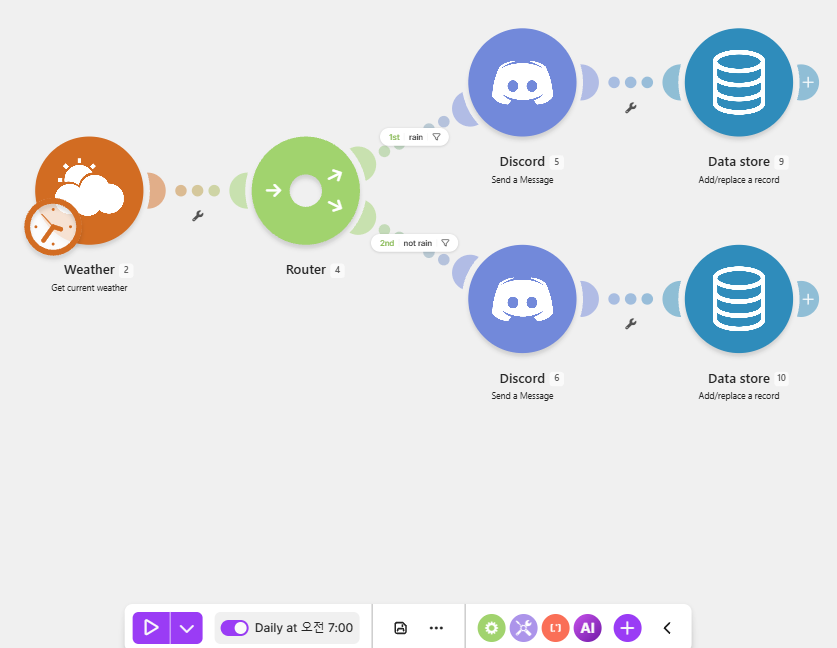
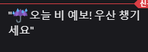
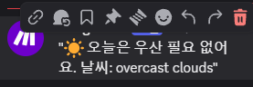
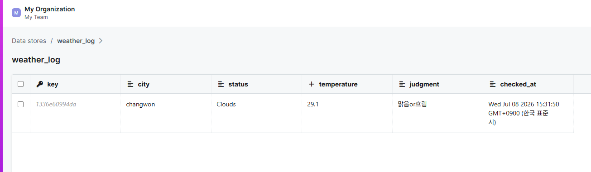
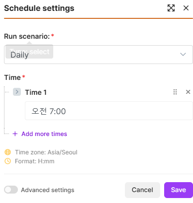

# 프로젝트 2 · 자유 주제 자동화 (날씨 기반 아침 알림)

매일 아침 자동으로 날씨를 조회해, 비 예보 여부에 따라 Discord로 알림을 보내고 조회 이력을 Make Data store에 기록하는 워크플로우입니다.

---

## 1. 자동화할 반복 업무 정의

**업무**: 매일 아침 오늘 날씨(특히 비 여부)를 확인하고, 비가 오면 우산을 챙기라고 스스로 리마인드하는 일.

**반복성/자동화 필요성**:
- 매일 아침 수동으로 날씨 앱을 열어 확인하는 것은 반복적이고 잊기 쉽다.
- "비 예보 시 우산 챙기기"라는 판단(조건 분기)이 개입되므로, 조회 → 판정 → 알림을 자동화하면 매일 일정한 시각에 빠짐없이 처리할 수 있다.

---

## 2. 선정 도구 및 선정 이유

**선정 도구: Make**

| 선정 이유 | 설명 |
|-----------|------|
| 스케줄 자동 실행 내장 | 별도 스케줄러 앱 없이 시나리오 자체에 "매일 07:00 실행" 스케줄을 설정할 수 있어 "Trigger 발생 시 자동 실행" 제약을 쉽게 충족 |
| Router로 조건 분기 용이 | 날씨 상태에 따른 비/맑음 분기를 시각적으로 명확하게 구현 |
| Weather 커넥터 무료 사용 | 별도 API 키 발급 없이 도시명만으로 현재 날씨 조회 가능 |
| Data store 내장 | 외부 앱(스프레드시트 등) 연결 없이 Make 내부 저장소에 이력 기록 가능 → 연동 부담·과금 리스크 최소화 |
| 프로젝트 1 경험 재사용 | 동일 도구라 학습 비용 없이 빠르게 구현 |

---

## 3. 워크플로우 설계

```
[Trigger]  Schedule - 매일 오전 7:00 자동 실행
      │
[Action 1]  Weather - 현재 날씨 조회 (도시: Changwon)
      │
  [조건 분기 · Router]  날씨 상태(Status) 판별
      │
      ├─ rain (Status = Rain)      → [Action 2a] Discord "☔ 오늘 비 예보! 우산 챙기세요"
      │                            → [Action 2b] Data store 기록 (judgment=비)
      │
      └─ not rain (그 외)          → [Action 2a] Discord "☀️ 오늘은 우산 필요 없어요"
                                   → [Action 2b] Data store 기록 (judgment=맑음/흐림)
```

### 단계별 설명

1. **Trigger (스케줄)**: Make 시나리오 스케줄을 `Daily 07:00 (Asia/Seoul)`로 설정하고 ON으로 활성화. 매일 아침 자동으로 시나리오가 실행된다.
2. **Action 1 (날씨 조회)**: Weather 모듈이 도시(Changwon)의 현재 날씨를 조회. 응답으로 Temperature, Status(Clouds/Rain/Clear 등), Description 등을 반환한다.
3. **조건 분기 (Router)**: Weather의 `Status` 값으로 분기.
   - `rain` 경로: Status가 Rain일 때
   - `not rain` 경로: 그 외(Clear, Clouds 등)
4. **Action 2 (알림 + 기록)**: 각 경로에서
   - Discord로 상황에 맞는 알림 메시지 전송
   - Data store(`weather_log`)에 조회 이력 저장 (city, status, temperature, judgment, checked_at)

### Data store 구조 (`weather_log`)

| 필드 | 타입 | 예시 |
|------|------|------|
| city | Text | changwon |
| status | Text | Clouds |
| temperature | Number | 29.1 |
| judgment | Text | 맑음/흐림, 비 |
| checked_at | Text | Wed Jul 08 2026 15:31:50 (now 함수) |

---

## 4. 요구사항 충족

| 요구사항 | 충족 여부 |
|----------|-----------|
| Trigger 1개 이상 | ✅ 스케줄 (매일 07:00) |
| Action 2개 이상 | ✅ Discord 알림 + Data store 기록 |
| 조건 분기 1개 이상 | ✅ Router (rain / not rain) |
| 각 경로 1회 이상 실행 | ✅ rain·not rain 모두 실행 확인 |
| Trigger 발생 시 자동 실행 | ✅ Daily 스케줄 ON |

> **rain 경로 실행 방법**: 실제 운영 시엔 창원 날씨에 따라 분기되지만, rain 경로 검증을 위해 테스트 시점에 강수 지역(비 오는 도시)을 조회하여 Status가 Rain으로 반환되도록 하여 rain 경로가 실제로 실행됨을 확인했다.

---

## 5. 구현 결과 (캡처)

**워크플로우 구성 + 스케줄 (Daily 07:00 ON)**



**실행 결과 - 비 예보 (rain 경로)**



**실행 결과 - 맑음/흐림 (not rain 경로)**



**Data store 기록 (weather_log)**



**스케줄 설정 (자동 실행)**



---

## 6. 이미지 파일 안내

최상위 `images/` 폴더에 아래 파일명으로 캡처를 넣어주세요:

- `weather-scenario.png` — 전체 시나리오 구성 + 하단 Daily 스케줄 토글
- `weather-discord-rain.png` — Discord "☔ 우산 챙기세요" 메시지
- `weather-discord-clear.png` — Discord "☀️ 우산 필요 없어요" 메시지
- `weather-datastore.png` — weather_log 저장 결과 테이블
- `weather-schedule.png` — Schedule settings (Daily 오전 7:00) 화면

> ※ 모든 캡처에서 Discord Webhook·봇 토큰·계정 이메일은 마스킹(`***`) 처리하세요.
